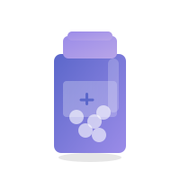

<p align="center"></p>

# DoseBuddy

My first solo app: a medication tracker built with Flutter.

DoseBuddy brings medication schedules, dose history and symptom notes into one place. Recording or correcting a dose updates the connected history, supply estimate and exports too.

## What you can do

- **Plan your schedule:** add medications, daily reminder times, amounts and course dates, or keep as-needed records.
- **Track doses:** record outcomes and correct a record if you made a mistake.
- **Look back:** browse calendar history and add, edit or delete symptom notes.
- **Manage changes:** edit medications, pause or resume a course, and update your remaining supply.
- **Scan a label:** start with on-device text recognition, then review the draft and enter the medication details yourself.
- **Export your records:** take your history with you and keep emergency information in the app.
- **Control privacy:** use encrypted local records, optional device authentication and private reminder text.

## A few things to try

Use made-up medication details for a demo.

1. **Follow one dose through the app.** Add a test medication, record a dose, then find it in the calendar. Correct the record and check the history again.
2. **Change your plans.** Pause a test medication and see how its upcoming schedule changes, then resume it.
3. **Leave a note for later.** Add a sample symptom, then edit or delete it from the history.
4. **Try the scanner on a sample label.** It gives you text to review rather than guessing a dose for you. Camera access depends on the device.
5. **Check an export.** Export your test records and compare them with what you entered.

## A part of the build worth looking at

The rebuild uses one shared record store across the app. A corrected dose or a changed schedule affects more than one screen, so the history, reminders and counts need to agree about what happened.

The rebuild is now on main. You can follow its development in [pull request #1](https://github.com/omuoguilim/DoseBuddy/pull/1).

## Built with

Flutter, Dart, Hive, local notifications, device authentication and Google ML Kit text recognition.

## Run

Use Flutter 3.47.2 and its bundled Dart SDK.

```sh
git clone https://github.com/omuoguilim/DoseBuddy.git
cd DoseBuddy
flutter pub get
flutter analyze --no-fatal-infos
flutter test
flutter run
```

On a Mac with Xcode, build the embedded-demo binary with:

```sh
flutter build ios --simulator --debug
```

The GitHub workflow also builds a simulator artifact for Appetize. Source changes alone do not update the existing website emulator.

## Product boundaries

Records are encrypted on the device. Optional device authentication protects access inside the app. There is no cloud account, caregiver sharing, interaction checker or dose recommendation service.

Daily clock-time schedules and as-needed records are supported. Reminders queue at most 60 future doses over 30 days and must be refreshed by opening the app. Operating-system delivery is not guaranteed. Scanned text is an unverified draft and requires manual checking.

Supply is an estimate. Updating the remaining quantity establishes a fresh baseline; correcting records from before that count does not change the new count. Manually reconcile supply again when necessary.

## Release review

Read [RELEASE_REVIEW.md](RELEASE_REVIEW.md) before distributing an upgrade. It documents migration limitations, physical-device checks, signing and store requirements. Merging the rebuild does not establish clinical validation or app-store approval. Physical-device validation and production signing remain release requirements.
